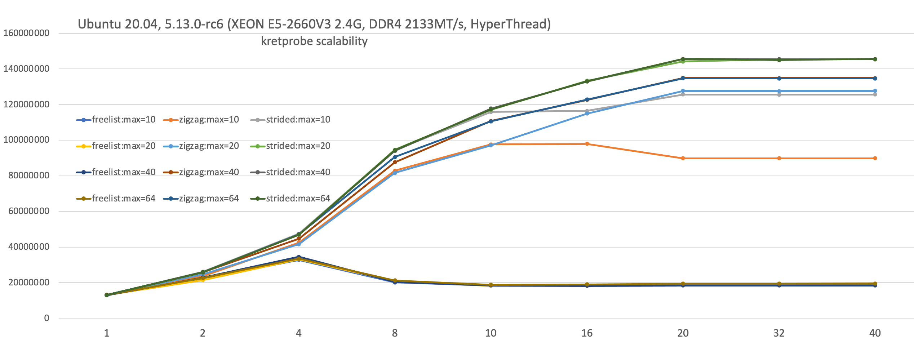
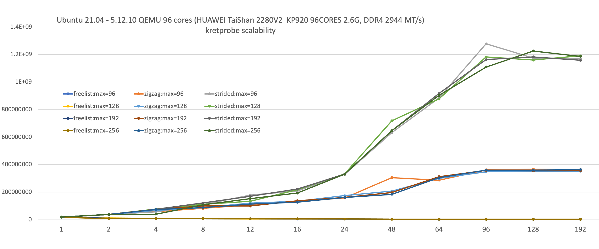

# kretprobe scalability improvement

The original freelist is a LIFO queue based on singly linked list, which lacks
of scalability, and thus becomes bottleneck under high workloads. freelist was
introduced by Masami Hiramatsu's work of removing kretprobe hash lock:
ref: https://lkml.org/lkml/2020/8/29/209.

Here an array-based MPMC lockless queue is proposed. The solution of bounded
array can nicely avoid ABA issue, while freelist or circular queue etc. have
to perform 2 CAS loops. The other advantage is that order and fairness can be
ignored, the only concern is to retrieve kretprobe instance records as fast
as possible, i.e. performance and correctness. Tests of kretprobe on 96-CORE
ARM64 show the biggest gain as 466.7x of the original freelist throughput.
The raw queue throughput can be 1,975 times of freelist. Here are the results:

```c
Ubuntu 20.04, 5.13.0-rc6 (XEON E5-2660V3 2.4G, DDR4 2133MT/s, 10 CORES/20 THREADS):
                1x        2x        4x        8x        10x        16x        20x        32x        40x
freelist: 13086080  22493637  32773854  20129772   18455899   18435561   18980332   18988603   18991334	
array   :  13144036  26059941  47449954  94517172  115856027  116414714  125692971  125553061  125685981

Ubuntu 21.04 - 5.12.10 QEMU 96 CORES (HUAWEI TaiShan 2280V2  KP920 96 CORES 2.6G, DDR4 2944 MT/s):
                  1x          2x          4x          8x          16x          24x          48x            96x           192x
freelist: 17,233,640  10,296,664   8,095,309   6,993,545    5,050,817    4,295,283    3,382,013      2,738,050      2,743,345
array:    19,360,905  37,395,225  56,417,463  10,020,136  209,876,209  328,940,014  632,754,916  1,277,862,473  1,169,076,739

```

Linear scalability is still not available,  limited by the following two
considerations:

1. keep it simple: best solution could be an implementation of per-cpu queues,
   but it's not applicable for this case due to coding complexity. After all for
   most cases the number of pre-allocated kretprobe instances (maxactive) is
   only a small value. If not specified by user during registering, maxactive
   is set as CPU cores or 2x when preemption is enabled
2. keep it compact: cache-line-alignment can solve false-sharing and minimize
   cache thrashing, but it introduces memory wasting, considering the small
   body of structure kretprobe_instance. Secondly the performance improvement
   of cache-line-aligned is not significant as expected

With a pre-built kernel, further performance tuning can be done by increasing
maxactive when registering kretprobe. Tests show 4x cores number is a fair
choice for both performance and memory efficiency.

# Performance comparison tests:



