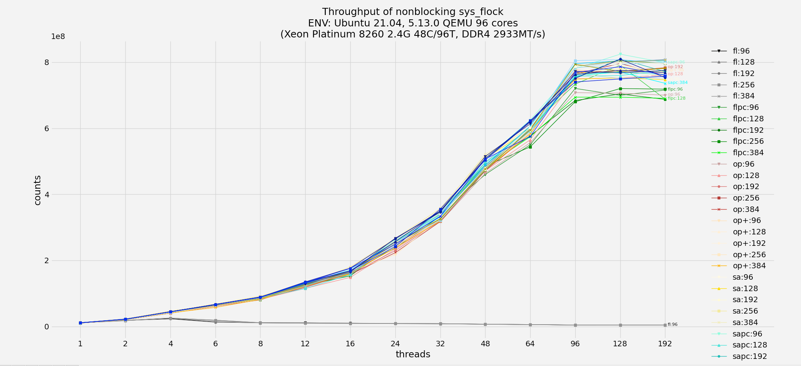

# kretprobe scalability improvement

## Introduction

kretprobe is using freelist to manage return instances, but freelist as
a LIFO queue based on singly linked list, scales badly and thus lowers
throughput of kretprobed routines, especially for high parallelization.
Here's a typical result (XEON 8260: 2 sockets/48 cores/96 threads):

```c
      1X       2X       4X       6X       8X      12X     16X
10880312 18121228 23214783 13155457 11190217 10991228 9623992
     24X      32X      48X      64X      96X     128X    192X
 8484455  8376786  6766684  5698349  4113405  4528009 4081401
```

This patch implements a scalabe, lock-less and numa-aware object pool
and as a result improves kretprobe to achieve near-linear scalability.
Tests of kretprobe throughput show the biggest gain as 181.5x of the
original freelist. The extreme tests of raw queue throughput can be up
to 388.8 times of the original. The comparison results are the followings:

```c
                  1X         2X         4X         8X        16X
freelist:  237911411  163596418   33048459   15506757   10640043
objpool:   234799081  294086132  585290693 1164205947 2334923746
                 24X        32X        48X        64X        96X
freelist:    9025299    7965531    6800225    5507639    4284752
objpool:  3508905695 1106760339 1101385147 1221763856 1211654038
```

The object pool is a percpu-extended version of original freelist,
with compact memory footprints and balanced performance results for
3 test caess: nonblockable retrieval (most kertprobe cases), bulk
retrieval in a row (multiple-threaded blockable kretprobe), huge
misses (preallocated objects much less than required).

Huge thanks to my workmates: Chengming Zhou, Muchun Song, Yue Chen
for their suggestions and remarks.

## kretprobe performance comparison



## raw queues performance:


